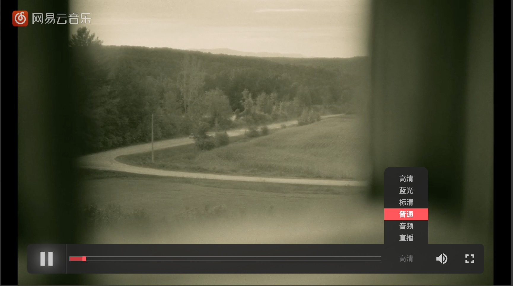
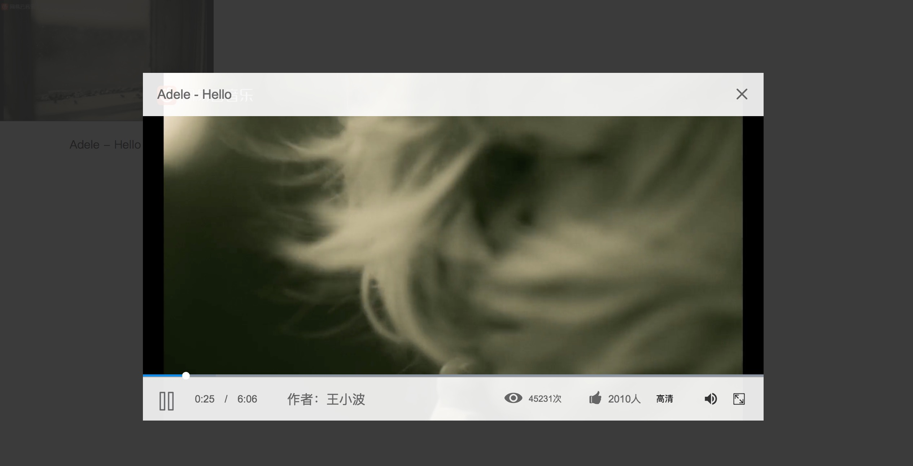
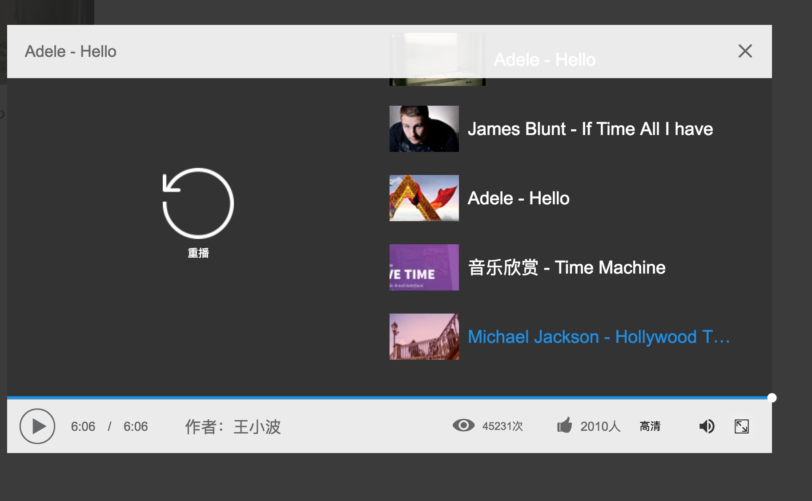

# 基于videojs进行扩展

### 基础版
增加了切换分辨率功能
<a href="http://hippor.com/static/video/index.html"></a>

### 弹框版
- 特殊的弹窗样式
- 控制条可自定义业务内容（点赞，观看数等）

<a href="http://hippor.com/static/video/index.html"></a>

- 播放完成后有视频推荐

<a href="http://hippor.com/static/video/index.html"></a>

## 修改内容

- 只兼容IE9+

- 打开sandbox中的`demo.html`可以直接使用
或者[在线访问](http://hippor.com/static/video/demo.html)

- 打开sandbox中的`index.html`可以直接使用
或者[在线访问](http://hippor.com/static/video/)

- 所有的样式都是在`src/css/custom中进行补充修改的`;
由于最开始是在一个[gaiamount](http://www.gaiamount.com/)中开始修改的,所以在样式中都有一个class叫做`gaia`


### 增加了在播放视频格式错误的时候调用flash播放器,该功能主要是在chrome上播放MPG4-VISUAL格式的视频时无法使用video播放
- player.js 2240
```javascript
    //判断当前是否使用的flash播放,如果不是,那么尝试使用flash
    if(this.techName_.toLowerCase() !== 'flash'){
      this.loadTech_('Flash', null);
      this.techCall_('reset');
      return this;
    }

```

### 增加了在没有url地址的时候提示`视频正在转码中...`
- control-bar/play-resolutions.js
```javascript
  var message = '没有播放地址';
  if(videos[idx]){
    message = videos[idx].errorMessage || '视频正在转码中,暂时不能播放...';
  }
```


### 移除`bigPlayButton`
使用自定义的控制条作为播放控制器。
- player.js
```javascript
    children: [
        'mediaLoader',
        'posterImage',
        'textTrackDisplay',
        'loadingSpinner',
        //'bigPlayButton',
        'controlBar',
        'errorDisplay',
        'textTrackSettings'
      ],
```

```scss
    .video-js.show-control .vjs-control-bar{
      display: -webkit-box;
      display: -webkit-flex;
      display: -ms-flexbox;
      display: flex;
      visibility: visible;
      opacity: 1;
      -webkit-transition: visibility 0.1s, opacity 0.1s;
      -moz-transition: visibility 0.1s, opacity 0.1s;
      -o-transition: visibility 0.1s, opacity 0.1s;
      transition: visibility 0.1s, opacity 0.1s;
    }
```

```html
    <video id="vid1" class="video-js gaia show-control vjs-default-skin " controls preload="auto" width="860" height="482" poster="img/B3.jpg">
      <source src="http://vjs.zencdn.net/v/oceans.mp4" type="video/mp4">
      <source src="http://vjs.zencdn.net/v/oceans.webm" type="video/webm">
      <source src="http://vjs.zencdn.net/v/oceans.ogv" type="video/ogg">
      <p>Video Playback Not Supported</p>
    </video>
```
增加class show-control,将vjs-control-bar display属性设置为flex.

### time-control
将时间修改为00：00
```javascript
    //remaining-time-display
  let time = (this.player_.scrubbing()) ? this.player_.getCache().currentTime : this.player_.currentTime();
  let formattedTime = formatTime(time, this.player_.duration());
  let formattedTime1 = formatTime(this.player_.duration());
  this.contentEl_.innerHTML = `<span class="vjs-control-text">${localizedText}</span>${formattedTime} | ${formattedTime1}`;
```

### 分辨率选择
增加分辨率选择组件，play-resolutions.js

调用方式：
```javascript
  vid1 = videojs('vid1',{
    controlBar: {
      volumeMenuButton: {
        inline: false,
        vertical: true
      },
      PlayResolutions:{
        idx:2,   //默认使用分辨率序号，videos序号 0开始
        videos:[
          {
            name:'2K',
            src:'./m3u8/2K.m3u8',
            type: 'application/vnd.apple.mpegurl'
          },
          {
            name:'1080p',
            src:'./m3u8/1080.m3u8',
            type: 'application/vnd.apple.mpegurl'
          },
          {
            name:'720p',
            src:'./m3u8/720.m3u8',
            type: 'application/vnd.apple.mpegurl'
          },
          {
            name:'480p',
            src:'./m3u8/480.m3u8',
            type: 'application/vnd.apple.mpegurl'
          }
        ]
      }
    }
  });
```

### 长宽比选择
增加长宽比选择组件，play-ratio.js
```javascript
  PlayerRatio:{
    idx:1,
    ratios:[
      {
        name:'16:9',
        width:'860',
        height:'483'
      },
      {
        name:'4:3',
        width:'860',
        height:'645'
      }
    ]
  }
```

###logo
在toolbar中增加logo logo-text.js
```javascript
  LogoText:{
    click:function(){
      console.log('this is logo');
    }
  }
```
click点击调用函数。
```scss
  .video-js.gaia .vjs-logo-control:before{
    border-left: 1px solid #666;
    border-right: none;
    content: '';
    background: url("/favicon.ico") center center no-repeat;
    display: inline-block;
    width: 66px;
    height: 50px;
  }
```
默认使用favicon图标

### 可以通过js向video里面插入HTML元素的方式增加额外内容。这些内容即使是全屏下也会显示。


### 关于hls aes加密下的一个坑
```javascript
  if (error || !request.response || request.response.byteLength !== 16) {
          key.retries = key.retries || 0;
          key.retries++;
          if (!request.aborted) {
            // try fetching again
            self.fetchKey_(segment);
          }
          return;
        }
```
注意，如果请求的是一个文件，并且该文件是被IDE进行了修改的。有一些IDE会在文件后面加一个换行符。这回导致这里判断失败。
